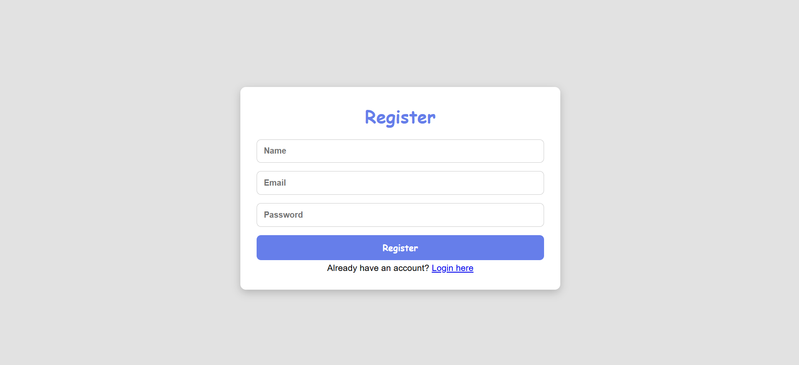
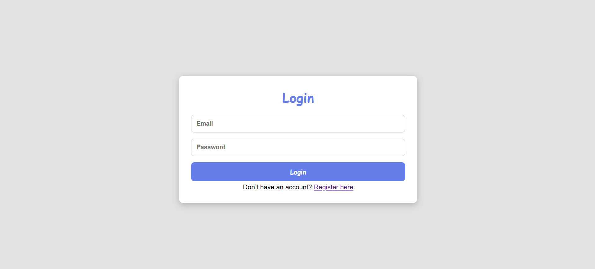
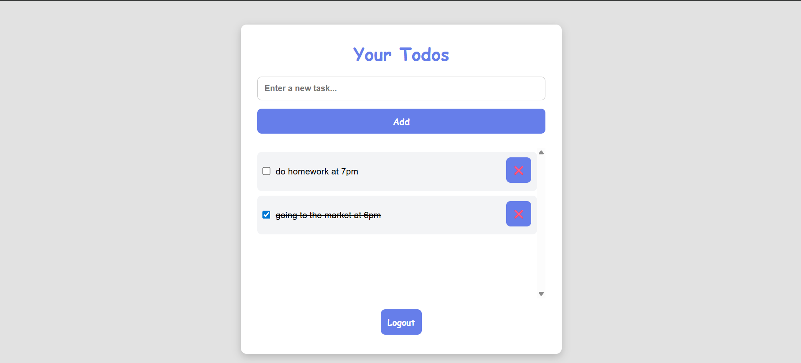

# Taskly Frontend

Taskly is a simple, modern web app for managing your daily tasks. This repository contains the frontend codebase built with HTML, CSS, and JavaScript.

---

## Features

- User registration and login (JWT authentication)
- Add, view, complete, and delete tasks
- Responsive and clean UI

---

## Tech Stack

- HTML, CSS, JavaScript

---

## Getting Started

1. Clone the repository:
	```powershell
	git clone https://github.com/AdinathJabade/Taskly-Frontend.git
	cd Taskly-Frontend
	```
2. Open `index.html`, `login.html`, or `register.html` in your browser
3. Update API URLs in `auth.js` and `script.js` if needed

---

## Folder Structure

```
Taskly-Frontend/
├── index.html      # Dashboard
├── login.html      # Login page
├── register.html   # Registration page
├── style.css       # Styles
├── auth.js         # Auth logic
├── script.js       # To-Do logic
└── .gitignore      # Git ignore
```

---

## Screenshots

Add screenshots in the `screenshots` folder and reference them here:

### Registration


### Login


### Dashboard


---

## License

MIT License

---

## Contact

- GitHub: [AdinathJabade](https://github.com/AdinathJabade)
- Email: adijabade5@gmail.com

---